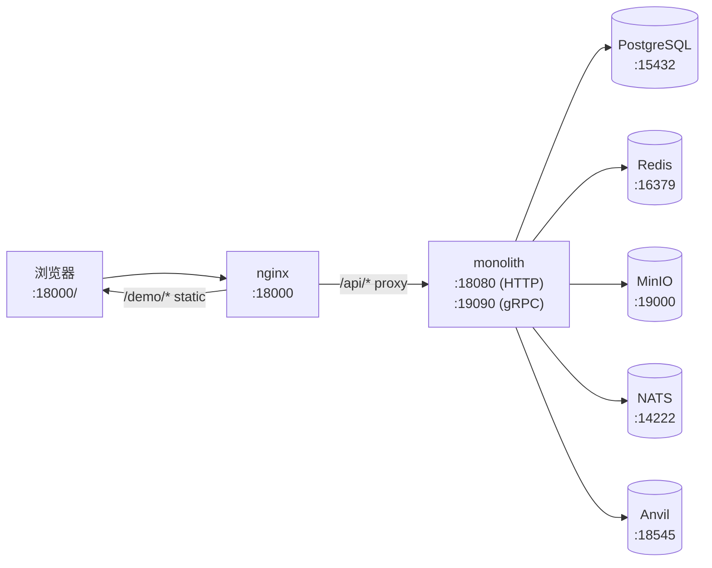
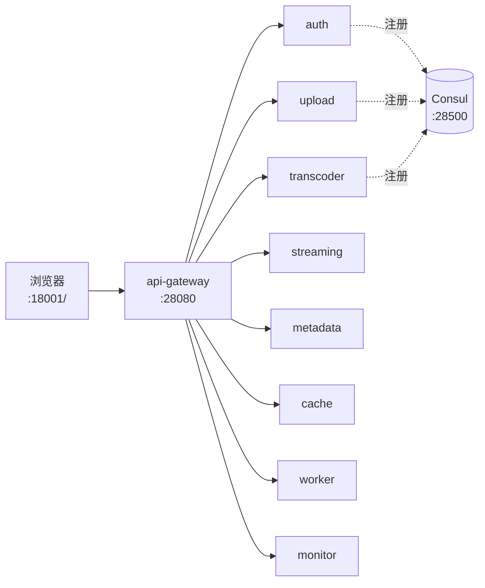

# StreamGate Deployment Guide

> **🎯 5 分钟跑起来**
>
> ```bash
> git clone https://github.com/rtcdance/streamgate.git && cd streamgate
> make deploy-monolith         # 7 个容器,30 秒起
> open http://localhost:18000/ # 浏览器立即可用
> ```
>
> 没跑起来?看 [§6 常见问题](#6-常见问题-troubleshooting) 解决 90% 的问题。

---

## 目录

- [0. 前置要求](#0-前置要求)
- [1. 我该选哪种部署?](#1-我该选哪种部署)
- [2. 5 分钟跑起来](#2-5-分钟跑起来)
- [3. 端口速查](#3-端口速查)
- [4. 架构概览](#4-架构概览)
- [5. 拆除 / 重建 / 状态](#5-拆除--重建--状态)
- [6. 常见问题 (Troubleshooting)](#6-常见问题-troubleshooting)
- [7. H5 Demo 操作流程](#7-h5-demo-操作流程)
- [8. 深入参考](#8-深入参考)

---

## 0. 前置要求

| 依赖 | 版本 | 备注 |
|------|------|------|
| Docker Desktop | 4.x+ | 含 `docker compose` v2 plugin (旧版 `docker-compose` v1 不行) |
| 可用内存 | 8 GB+ | monolith 模式 4 GB 勉强够,microservices 模式建议 8 GB+ |
| 可用磁盘 | 10 GB+ | 镜像 + Anvil 链上数据 + MinIO 对象 |
| 操作系统 | macOS / Linux / WSL2 | Windows 原生不支持 Anvil |
| 网络 | 首次需访问 `ghcr.io` 拉镜像 | 约 200 MB,需 3-5 分钟 |

> 💡 **检查环境**:`docker info` 能输出即就绪。

---

## 1. 我该选哪种部署?

```
你想做什么?
│
├─ 只是想本地跑一下看效果
│   └─→ make deploy-monolith         (7 容器, 30 秒)
│
├─ 想体验完整微服务架构
│   └─→ make deploy-microservices    (15 容器, 2-3 分钟)
│
└─ 两个都要,模拟真实生产环境
    └─→ make fullchain-deploy        (17 容器, 5 分钟)
```

| 模式 | 容器数 | API 端口 | 前端端口 | 适合 |
|------|-------|---------|---------|------|
| **Monolith** | 7 | `:18080` | `:18000` | 本地开发、面试演示、单机 demo |
| **Microservices** | 15 | `:28080` (api-gateway) | `:18001` | 模拟生产、压测、服务级调试 |
| **Fullchain (Dual)** | 17 | `:18080` + `:28080` | `:18000` + `:18001` | 同时演示两种模式 |

> 💡 **不确定选哪个?默认选 monolith** — 更快、更简单,功能完全一致。

---

## 2. 5 分钟跑起来

以 **monolith** 为例(其它模式命令相同,只是改 target 名):

```bash
# 1. 启动 (5-30 秒)
make deploy-monolith

# 2. 等到看到 "Monolith deployment complete!"
#    (脚本会等所有容器 healthy,最多 90 秒)

# 3. 一键健康检查 (8 项)
./scripts/verify-deploy.sh monolith

# 应该看到:
#   Pass: 8  Warn: 0  Fail: 0
#   ✅ All checks passed — deployment is healthy.

# 4. 打开浏览器
open http://localhost:18000/        # H5 Demo (推荐)
open http://localhost:19001/        # MinIO 控制台 (minioadmin / minioadmin)
curl http://localhost:18080/health  # 应该返回 {"status":"ok",...}
```

### 看到什么算成功?

- [x] `make deploy-monolith` 输出 "Monolith deployment complete!"
- [x] `verify-deploy.sh` 报告 `Pass: 8 / Fail: 0`
- [x] `make deploy-status` 看到 7+ 容器全 `healthy`
- [x] 浏览器打开 `:18000/` 看到 h5-demo 首页
- [x] 浏览器点击 "Demo Mode" → "Sign & Login" → 绿色 "Authenticated" 徽章

### 其它模式命令

```bash
make deploy-microservices    # 微服务 (15 容器,API 端口 :28080)
./scripts/verify-deploy.sh microservices

make fullchain-deploy        # 双模式一起跑 (17 容器, :18080 + :28080)
make fullchain-teardown      # 停止 + 保留数据
make deploy-teardown         # 停止 + 删数据 (-v)
```

---

## 3. 端口速查

只列**从你的电脑(host)能直接访问**的端口。其它端口(Redis/Postgres/NATS)只在容器内部使用。

| 端口 | 服务 | 模式 | 说明 |
|------|------|------|------|
| **:18000** | nginx (h5-demo) | monolith / fullchain | 浏览器访问这里 |
| **:18001** | nginx (h5-demo) | microservices / fullchain | 浏览器访问这里 |
| **:18080** | monolith API | monolith / fullchain | curl / API client |
| **:28080** | api-gateway | microservices / fullchain | curl / API client |
| **:19090** | monolith gRPC | monolith | `grpcurl` 用 |
| :18545 | Anvil RPC | 全部 | MetaMask Custom RPC: `http://localhost:18545`,Chain ID `31337` |
| :19000 | MinIO API | 全部 | 对象存储 |
| :19001 | MinIO Console | 全部 | 浏览器看上传的视频文件 (minioadmin / minioadmin) |
| :15432 | PostgreSQL | monolith | 调试用,`psql -h localhost -p 15432 -U postgres` |
| :16379 | Redis | monolith | 调试用,`redis-cli -p 16379` |
| :14222 | NATS | monolith | 调试用,`nats sub -s nats://localhost:14222` |
| :28500 | Consul | microservices / fullchain | 服务发现 UI |

> ⚠️ **微服务模式下 `auth/transcoder/upload/streaming/metadata/cache/worker/monitor` 这 8 个微服务不直接暴露 host 端口** — 所有请求走 `:28080` 的 api-gateway 路由。

---

## 4. 架构概览

### Monolith 模式



**特点**:所有功能在 `monolith` 一个进程里(通过 plugin 机制加载),nginx 仅做静态文件服务 + `/api` 反向代理。

### Microservices 模式



**特点**:9 个独立微服务通过 Consul 服务发现 + NATS 消息队列通信。**前端直连 `:28080` api-gateway**,nginx (`:18001`) 仍可用,但只是反代。

### 部署规模对比

| 维度 | Monolith | Microservices |
|------|----------|---------------|
| 容器数 | 7 | 15 |
| 启动时间 | ~30s | ~3min |
| 内存占用 | ~2 GB | ~5 GB |
| 横向扩展 | ❌ (要复制整个进程) | ✅ (单服务可独立扩) |
| 故障隔离 | ❌ (一个 bug 整个挂) | ✅ (单服务挂不影响全局) |
| 适用场景 | 开发 / 演示 / 单机 | 生产 / 压测 / 灰度 |

---

## 5. 拆除 / 重建 / 状态

```bash
make deploy-status     # 看所有容器状态 (Status / Ports)
make deploy-logs       # 跟踪所有容器日志 (Ctrl-C 退出)
make deploy-teardown   # 停止 + 删除数据卷 (完全清理)

# 想保留数据,只停服务:
docker compose -f docker-compose.fullchain.yml stop

# 想重建镜像(改了代码后):
make deploy-monolith -- --build     # 注意: -- 要把 --build 传给 make
# 或者:
./scripts/docker-deploy-monolith.sh --build

# 完全清理后从头来:
make deploy-teardown && make deploy-monolith
```

---

## 6. 常见问题 (Troubleshooting)

### ❌ `Cannot connect to the Docker daemon`

**原因**:Docker Desktop 没启动。

**解决**:
- macOS: 打开 Docker Desktop,等菜单栏图标变绿
- Linux: `sudo systemctl start docker`
- 验证: `docker info` 应输出 "Server Version"

### ❌ `no such service: streamgate`

**原因**:`Makefile` 老版本 bug,`streamgate` 服务不存在(实际叫 `monolith`)。

**解决**:升级到最新代码 (`git pull`),或在 Makefile 把 `streamgate` 改成 `monolith`。

### ❌ `no such service: jaeger / prometheus / grafana`

**原因**:监测栈服务未在 `docker-compose.fullchain.yml` 中定义。

**解决**:升级到最新代码,或从 `Makefile` 的 `deploy-microservices` target 移除这三个服务名。

### ❌ `port is already allocated`

**原因**:上次没拆干净,或别的程序占了端口。

**解决**:
```bash
make deploy-teardown        # 拆掉旧部署
lsof -i :18080              # 找占用 18080 的进程
```

### ❌ 浏览器打开 :18000/ 显示 502 Bad Gateway

**原因**:后端容器还没 ready,nginx 转发到了还没启动的 monolith。

**解决**:等 30 秒后刷新。脚本会等所有容器 healthy 才返回。

### ❌ `curl :28080/health` 返回 connection refused

**原因**:你只跑了 monolith 模式,但试图访问微服务端口。

**解决**:
- 跑 monolith 用 `:18080/health`
- 跑 microservices 用 `:28080/health`
- 跑 fullchain 两个都能用

### ❌ Anvil: `connection refused` / `Nonce too high`

**原因**:Anvil 容器没启动,或者你的 wallet nonce 比链上多(常见于重启后)。

**解决**:
- 检查 `docker ps` 是否有 `sg-fc-anvil`
- MetaMask: Settings → Advanced → Clear activity tab data

### ❌ NFT Verify 返回 `has_nft: false`

**原因**:
- 1. 钱包连错了链(应该在 Custom RPC `localhost:18545`,Chain ID `31337`)
- 2. 钱包在 Anvil 上没 NFT(用 Demo Mode 自动 mint,或手动 `cast send`)
- 3. 合约地址填错了(默认是 `0x5FbDB2315678afecb367f032d93F642f64180aa3`)

### ❌ `./scripts/verify-deploy.sh` 报告 `Fail: 1+`

**解决**:看哪一项失败,对照本节找对应问题。**先确保 Docker 健康,再确保容器全 healthy,最后才看 API/前端。**

---

## 7. H5 Demo 操作流程

部署成功后,浏览器打开 `:18000/`(monolith)或 `:18001/`(microservices),按这个顺序点:

```
1. 顶部 "Backend"  →  Save Backend URL (默认已填对)
2. "Wallet"        →  Connect Wallet
                      ├─ MetaMask: 选 MetaMask 账户
                      └─ Demo Mode: 自动用 Anvil 账户 0
3. "Sign & Login"  →  MetaMask 弹出签名 → Authenticated ✓
4. "Verify NFT"    →  应该看到 has_nft: true, balance: 1+
5. "Upload"        →  选 .mp4 文件 → 上传 → 进度条 0→100%
6. "Transcode"     →  Submit Task → 看到多档位进度 (360p/480p/720p/1080p)
7. "Playback"      →  输入 content_id → Play → HLS 自适应播放
8. "RPC"           →  Load RPC Status → 看到 Anvil 节点健康
```

> 💡 **完整文档**:`h5-demo/README.md`

---

## 8. 深入参考

- **架构细节**:`docs/ARCHITECTURE_GUIDE.md`
- **微服务深入**:`docs/advanced/DEPLOYMENT_STRATEGIES.md`
- **生产部署 (K8s)**:`deploy/k8s/`
- **故障排查**:`docs/advanced/OPERATIONAL_EXCELLENCE.md`
- **Web3 集成**:`docs/web3-faq.md`

---

**最后更新**: 2026-06-05
**代码行数**: 2,000+ Go · 1,300+ Solidity · 4,500+ HTML/JS/CSS
