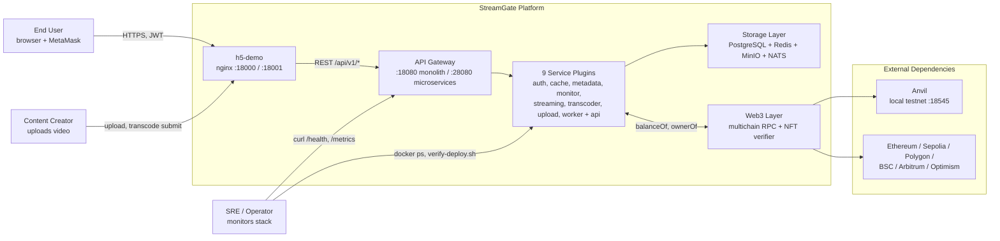
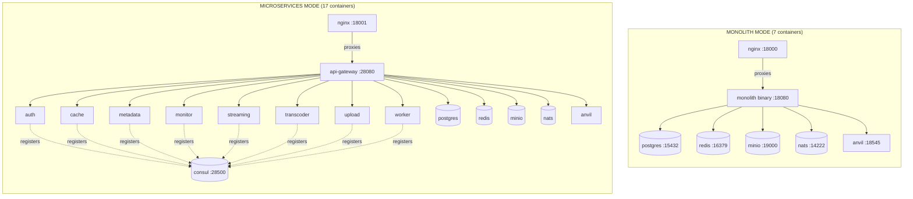
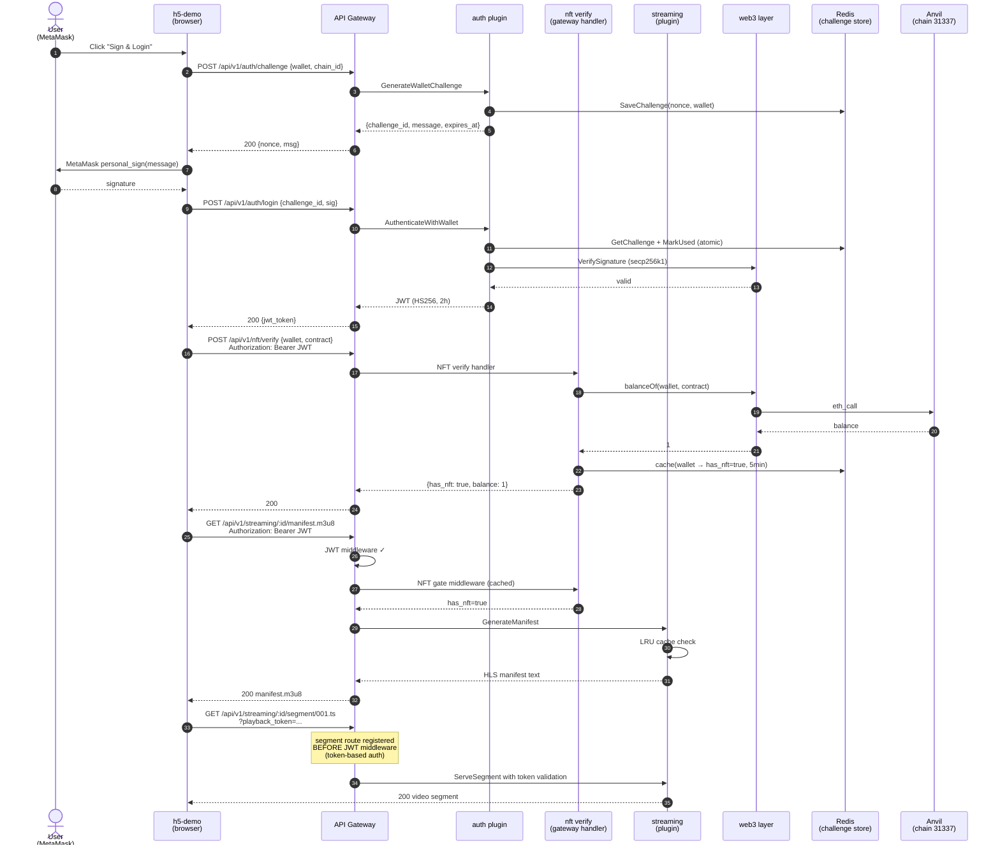
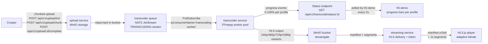

# StreamGate Architecture

> **Date**: 2026-06-05
> **Source**: Direct code analysis (not from any pre-existing doc)
> **Status**: Single source of truth for system architecture
> **Last verified against**: `master` branch (commit `96beacf`)

This document is the entry point for understanding StreamGate's architecture. It covers the **current** state of the code — not aspirational or planned features. For detailed deep-dives, see:

- [architecture/microkernel.md](architecture/microkernel.md) — plugin system, lifecycle, registry
- [architecture/microservices.md](architecture/microservices.md) — 9 microservices, why api-gateway is different
- [architecture/data-flow.md](architecture/data-flow.md) — auth, NFT, streaming, transcoding flows
- [architecture/communication.md](architecture/communication.md) — HTTP, gRPC, event bus, token propagation
- [operations/monitoring.md](operations/monitoring.md) — health, metrics, what's deployed vs what's missing

---

## 1. What StreamGate Is

A Go-based NFT-gated video streaming platform. The business flow is:

```
User holds NFT  →  wallet sign-in  →  NFT ownership verified  →  HLS playback unlocked
```

Two deployment modes share the same codebase:

| Mode | Use case | Containers | API port | Frontend |
|------|----------|-----------|----------|----------|
| **Monolith** | Dev, demo, interview | 7 | `:18080` | `:18000` |
| **Microservices** | Prod-like, scaling, service-level debugging | 17 | `:28080` (api-gateway) | `:18001` |
| **Full-chain (dual)** | Both running side-by-side | 17 (6 infra + 1 web + 1 monolith + 9 microservices) | `:18080` + `:28080` | `:18000` + `:18001` |

See [DEPLOY.md](../DEPLOY.md) for boot instructions.

---

## 2. System Context (C4 Level 1)



---

## 3. Dual Deployment Mode (Same Code, Different Topology)



**Key insight**: The 8 non-gateway services (auth, cache, metadata, monitor, streaming, transcoder, upload, worker) all run **inside** the monolith binary in monolith mode (with HTTP servers skipped to avoid port conflicts) and run as **separate binaries** in microservices mode. Same code, different wiring.

---

## 4. Microkernel + Plugin Architecture (C4 Level 2)

```mermaid
flowchart TB
    subgraph Microkernel["pkg/core/ — Microkernel"]
        MK[Microkernel<br/>+ topo sort + lifecycle]
        EP[EventBus<br/>Memory or NATS]
        CM[ConfigManager<br/>Viper + hot reload]
        REG[PluginFactory Registry<br/>init()-based]
        GC[GracefulShutdown<br/>drain + signal]
    end

    subgraph Plugins["pkg/plugins/ — 9 Plugin Packages"]
        P1[api-gateway<br/>full custom, 233 lines]
        P2[auth<br/>GenericPlugin, 18 lines]
        P3[cache<br/>manual, 98 lines]
        P4[metadata<br/>manual, 98 lines]
        P5[monitor<br/>manual, 98 lines]
        P6[streaming<br/>manual + DependsOn, 103 lines]
        P7[transcoder<br/>manual, 98 lines]
        P8[upload<br/>manual, 98 lines]
        P9[worker<br/>manual, 98 lines]
    end

    subgraph Servers["pkg/service/ — Server Structs"]
        S1[GatewayServer]
        S2[AuthServer]
        S3[CacheServer]
        S4[MetadataServer]
        S5[MonitorServer]
        S6[StreamingServer]
        S7[TranscoderServer]
        S8[UploadServer]
        S9[WorkerServer]
    end

    REG -.->|init() registers factory| MK
    P1 -->|Init returns| S1
    P2 -->|Init returns| S2
    P3 -->|Init returns| S3
    P4 -->|Init returns| S4
    P5 -->|Init returns| S5
    P6 -->|Init returns| S6
    P7 -->|Init returns| S7
    P8 -->|Init returns| S8
    P9 -->|Init returns| S9
    MK -->|Start, Shutdown| EP
    MK -->|hot reload| CM
    MK -->|drain state| GC
```

**Lifecycle** (in order): `topoSort(plugins, deps)` → `Init(ctx, kernel)` for each → `Start(ctx)` for each (skipped for non-api-gateway in monolith) → `Shutdown(ctx)` in reverse order with 30s drain.

See [architecture/microkernel.md](architecture/microkernel.md) for full details.

---

## 5. Core Data Flow: Auth → NFT → Streaming



---

## 6. Media Pipeline: Upload → Transcode → HLS



Profiles supported: `240p`, `480p`, `720p` (default), `1080p`. Output format: HLS (`.m3u8` + `.ts`).

---

## 7. Code Organization

| Path | Purpose | Lines (approx) |
|------|---------|----------------|
| `cmd/monolith/streamgate/` | Single binary entry | 120 |
| `cmd/microservices/` | 9 service binaries (api-gateway + 8 others) | 89-118 each |
| `cmd/migrate/` | Standalone migration tool | — |
| `cmd/learn/` | CLI learning tool | — |
| `pkg/core/` | Microkernel, plugin, event bus, config, graceful | ~3000 |
| `pkg/core/config/` | Viper-based config + hot reload | ~1500 |
| `pkg/core/event/` | Event bus (Memory + NATS) | ~250 |
| `pkg/plugins/` | 9 plugin implementations | 18-233 each |
| `pkg/service/` | Business logic (auth, nft, streaming, transcoding, upload, content, gating, playbackstats, category) | — |
| `pkg/service/streamingsvc/` | StreamingService (HLS manifest + segment) | — |
| `pkg/service/transcoding/` | TranscodingService (FFmpeg pipeline) | — |
| `pkg/gateway/` | REST API layer (Gin) — 48 files | — |
| `pkg/middleware/` | 12 middlewares (auth, cors, ratelimit, nft_gate, circuitbreaker, tracing, drain) | — |
| `pkg/web3/` | Blockchain integration (48 files) | — |
| `pkg/web3/signature/` | EIP-191, EIP-712, SIWE, EIP-1271, ed25519, HD wallet | — |
| `pkg/web3/nft/` | ERC-721/1155/20, ERC-165 detection, multichain | — |
| `pkg/storage/` | PostgreSQL, Redis, MinIO, S3, NATS queue | — |
| `pkg/models/` | 17 data models with status transitions | — |
| `pkg/monitoring/` | Prometheus metrics + tracing | — |
| `pkg/api/` | protobuf-generated gRPC stubs | — |
| `h5-demo/` | Admin console SPA (HTML + ethers.js + hls.js) | 6000+ |
| `contracts/` | Foundry smart contracts (DemoNFT, TestNFT) | — |
| `deploy/nginx/` | nginx config (dual-port, CSP, /metrics proxy) | — |
| `migrations/` | 31 versioned SQL migrations | — |
| `docker-compose.fullchain.yml` | 17-service compose for dual mode | 469 |
| `Dockerfile` | Multi-stage build (alpine + distroless) | 116 |

---

## 8. Key Architectural Decisions

### Why microkernel + plugin?

The 9 functional areas (api, auth, cache, metadata, monitor, streaming, transcoder, upload, worker) all share the same infrastructure: PostgreSQL, Redis, MinIO, NATS, config, logger, event bus. The microkernel extracts the shared parts; each plugin is a thin wrapper over its server struct. This means:

- **One codebase for both monolith and microservices** — no forking or code duplication
- **Consistent lifecycle** — topological dependency ordering, init/start/stop in correct order
- **Pluggable event bus** — Memory for monolith (low latency, in-process), NATS for microservices (cross-process, durable)
- **Hot config reload** — `ConfigManager` watches config file, all components re-read on change

### Why api-gateway bypasses the microkernel?

When the api-gateway runs as a standalone binary, it needs to:
- Bypass plugin registration (no factory needed)
- Directly wire `gateway.SetupRouter()` with all 48 handler files
- Directly wire `gateway.SetupGRPCServer()` with interceptors, TLS, reflection
- Skip Consul registration (it IS the gateway; other services register with it via Consul)

So `cmd/microservices/api-gateway/main.go` is 118 lines of custom code, not 89 lines of standard kernel boilerplate. The other 8 microservices use the standard pattern.

### Why three plugin styles (GenericPlugin / Manual / Custom)?

- **`GenericPlugin`** (1 plugin: auth) — boilerplate wrapper, 18 lines, perfect for stateless services
- **Manual Plugin** (7 plugins: cache, metadata, monitor, transcoder, upload, worker, streaming) — 98-103 lines, needed when the plugin has its own dependencies (e.g., `streaming` needs to register HTTP routes conditionally in monolith)
- **Custom Plugin** (1 plugin: api) — 233 lines, needed because the gateway is special (handles all 48 handler files, has dual HTTP+gRPC, has a unique startup sequence)

**Known tech debt**: `pkg/core/microservice.go:RunMicroservice()` is a helper that would reduce 8 of the 9 microservice main.go files to 5 lines each, but no binary actually uses it.

### Why dual deployment mode?

- **Monolith** is fast to boot (30s, 7 containers), simple to debug, perfect for dev/demo
- **Microservices** is how production runs (independent scaling, fault isolation, per-service resource limits)
- **Fullchain** (both running) is for interview prep and side-by-side comparison

The same code path through the codebase works in both modes. The only difference is whether 8 services share a process or each has their own.

### Why HLS (not DASH, not WebRTC)?

HLS has the best browser support (Safari native, all others via hls.js), the simplest CDN model, and works with standard video players. DASH has better codec flexibility but worse Safari support. WebRTC is for real-time (low latency, no VOD use case here). See [web3-faq.md](../web3-faq.md) for streaming architecture details.

---

## 9. Cross-cutting Concerns

### Security

- **JWT secret**: `fullchain-acceptance-secret-2026` (dev/acceptance). In production, use 32+ random bytes from secret manager.
- **Replay protection**: `MarkChallengeUsed()` is atomic (Redis `SETNX` or in-memory `sync.Map` with `LoadOrStore`).
- **TOCTOU prevention**: NFT verify and streaming gate both check the same cache key with the same TTL.
- **Circuit breaker**: 7 critical paths wrapped (PostgreSQL, Redis, MinIO, NATS, RPC clients). Configurable thresholds.
- **CORS**: `STREAMGATE_CORS_ORIGINS` env var, defaults to `localhost:18000,localhost:18001,...`
- **CSP**: nginx serves h5-demo with strict Content-Security-Policy (no inline scripts in prod).
- **Auth-required reorg protection**: NFT cache invalidates on chain reorg events (event bus subscription).

### Observability

- **What's deployed**: `/health`, `/ready`, `/health/live`, `/metrics` (Prometheus text format) on every HTTP-exposed service
- **What's missing**: Full Prometheus + Grafana + Jaeger stack was removed during simplification. The `/metrics` endpoint exists but is not scraped by anything in the fullchain compose. See [operations/monitoring.md](operations/monitoring.md).
- **Manual monitoring**: `make deploy-status` (container health), `./scripts/verify-deploy.sh` (8-point health check), `./scripts/fullchain-acceptance.sh` (11-step API acceptance)

### Token Types

| Token | Issuer | Lifetime | Used for |
|-------|--------|----------|----------|
| JWT (HS256) | auth plugin | 2h | All `/api/v1/*` endpoints except segment route |
| Playback token | streaming service | per-manifest | HLS segment access (replaces JWT for CDN scenarios) |
| Challenge nonce | auth service | 5min | One-time wallet signature |

---

## 10. What This Doc Does Not Cover

- **Smart contracts** (Foundry, DemoNFT, TestNFT) — see [web3-faq.md](../web3-faq.md) and [docs/web3/](../web3/)
- **Smart contract integration safety** — see [.codex/skills/smart-contract-integration-safety](../.codex/skills/smart-contract-integration-safety/SKILL.md)
- **Detailed API reference** — see [docs/api/API_DOCUMENTATION.md](../api/API_DOCUMENTATION.md)
- **Deployment operations** — see [DEPLOY.md](../../DEPLOY.md) and [docs/deployment/COMPLETE_DEPLOYMENT_GUIDE.md](../deployment/COMPLETE_DEPLOYMENT_GUIDE.md)
- **H5 demo features** — see [h5-demo/README.md](../../h5-demo/README.md)
- **CI/CD** — see [.github/](../../.github/) workflows and [docs/development/GITHUB_CI_CD_GUIDE.md](../development/GITHUB_CI_CD_GUIDE.md)
- **Interview prep** — see [docs/INTERVIEW_PACKAGE_INDEX.md](../INTERVIEW_PACKAGE_INDEX.md)

---

## 11. Known Issues & Tech Debt

1. **`RunMicroservice()` is unused** — `pkg/core/microservice.go` exists but no binary calls it. The 8 non-gateway services write 89 lines of boilerplate each.
2. **Plugin naming inconsistency** — `pkg/plugins/api/gateway.go` is named differently from the other 8 `pkg/plugins/*/plugin.go`.
3. **Service file location inconsistency** — `pkg/service/streamingsvc/` and `pkg/service/transcoding/` are subdirectories, but `pkg/service/auth_wallet.go` and `pkg/service/nft.go` are flat files. The other 6 service areas are in subdirectories: `content/`, `upload/`, `gating/`, `playbackstats/`, `category/`, `serviceerrors/`.
4. **Full Prometheus stack not deployed** — `/metrics` endpoint exists but isn't scraped. Re-add `prometheus` and `grafana` services to compose for production observability.
5. **8 microservice HTTP servers are untested in CI** — the per-service binaries (`cmd/microservices/{auth,cache,metadata,monitor,streaming,transcoder,upload,worker}/main.go`) may not have been run end-to-end.
6. **ERC-4337 types are defined but not wired** — `pkg/web3/account_abstraction.go` exists but isn't called from any handler. P2 feature.

See [docs/advanced/IMPLEMENTATION_ROADMAP.md](../advanced/IMPLEMENTATION_ROADMAP.md) for the prioritized tech debt list.
