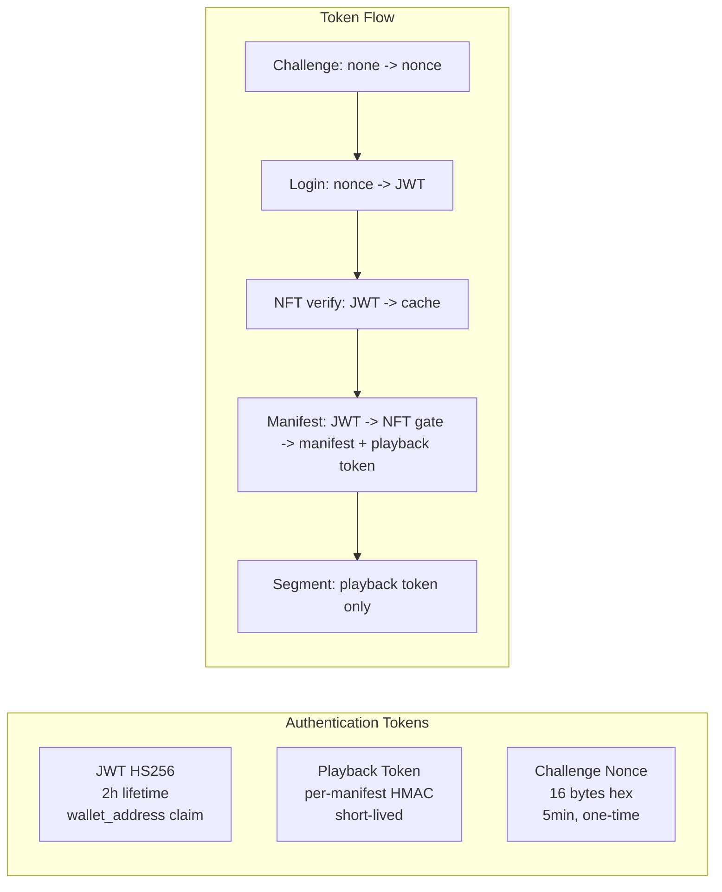

# Communication

> **Date**: 2026-06-05
> **Source**: Code analysis of `pkg/gateway/`, `pkg/middleware/`, `pkg/core/event/`, `pkg/storage/`
> **Status**: Single source of truth for inter-service communication
> **Last verified against**: `master` branch (commit `96beacf`)

This document describes the 3 communication protocols, token propagation, CORS configuration, and middleware stack. Master context: [ARCHITECTURE.md](../ARCHITECTURE.md#8-key-architectural-decisions). See also [microservices.md](microservices.md) for service discovery topology and [data-flow.md](data-flow.md) for request sequences.

---

## 1. Protocol Layers

```mermaid
flowchart TB
    subgraph CLIENT["Client Layer"]
        H5[h5-demo nginx :18000 / :18001]
        EXT[External HTTP clients]
    end

    subgraph HTTP["REST over HTTP (Gin)"]
        GW[api-gateway<br/>port from config, default :8080]
        MW[12-middleware stack<br/>logging, tracing, CORS,<br/>rate limit, drain, JWT,<br/>security headers, etc.]
        ROUTES[48 handler files<br/>/api/v1/auth, /nft, /streaming,<br/>/transcode, /upload, /content]
    end

    subgraph GRPC["gRPC (microservice mode only)"]
        GS[gRPC server :9090<br/>pkg/gateway/grpc_server.go<br/>1246 lines]
        INT[Interceptors:<br/>logging, recovery, tracing,<br/>auth, rate limit, validation]
        HEALTH[Health protocol<br/>grpc.health.v1.Health]
        TLS[TLS certificate<br/>server-side auth]
    end

    subgraph EVENT["Event Bus"]
        MEM[MemoryEventBus<br/>monolith mode only<br/>in-process pub/sub]
        NATS[NATS JetStream<br/>microservice mode<br/>cross-process pub/sub]
        TYPES[14 event types<br/>cache.warmed, nft.verified,<br/>streaming.started, job.*, alert.*]
    end

    subgraph DISCOVERY["Service Discovery"]
        CONSUL[Consul :28500<br/>microservice mode only]
        REG[8 services register<br/>on startup]
        CHK[Health checks<br/>TTL-based]
    end

    EXT -->|REST| H5
    H5 -->|nginx proxy_pass| GW
    GW --> HTTP
    HTTP --> ROUTES
    GW -.->|gRPC (discover via Consul)| GS
    GS -->|protobuf| MICRO[auth, cache, metadata,<br/>monitor, streaming, transcoder,<br/>upload, worker]
    GW -->|events| MEM
    GW -->|events| NATS
    MEM -.->|in-process| PLUGINS1[Local plugin handlers]
    NATS -.->|JetStream| PLUGINS2[Remote service handlers]
    MICRO -.->|registers| DISCOVERY
```

### HTTP (REST)

`pkg/gateway/gateway.go:26-122` builds the Gin router. The pattern is:

1. `SetupRouter(cfg, log, opts...)` creates all dependencies via `provide*()` functions
2. `setupMiddleware()` at line 124 applies the 12-middleware stack
3. `registerRoutes()` at `pkg/gateway/routes.go:25` registers all routes

In monolith mode, the api-gateway plugin calls `SetupRouter()` via the microkernel. In microservice mode, the api-gateway binary calls it directly, bypassing the kernel.

### gRPC

`pkg/gateway/grpc_server.go` (1246 lines) implements:

- gRPC server with interceptors (logging, recovery, tracing, auth, rate limit, input validation)
- Health protocol (`grpc.health.v1.Health`) for Kubernetes probes and Consul checks
- TLS certificate support for server-side authentication
- gRPC reflection for `grpcurl` debugging

In microservice mode, the api-gateway uses gRPC to call the other 8 services. In monolith mode, gRPC is not used -- all calls happen in-process via Go function calls.

### Event Bus

`pkg/core/event/event.go:38-43` defines the interface. Two implementations:

| Implementation | File | When used | Latency | Durability |
|---|---|---|---|---|
| MemoryEventBus | `pkg/core/event/event.go:55-201` | Monolith mode | Sub-microsecond | None (in-memory) |
| NATS JetStream | `pkg/storage/nats_queue.go` | Microservice mode | Milliseconds | Persistent (disk) |

14 event types are defined in `pkg/core/event/event.go:19-34`, including:

- `cache.warmed`, `nft.verified` -- cache-related events
- `streaming.started`, `streaming.stopped` -- playback events
- `job.submitted`, `job.completed`, `job.failed` -- transcoding job lifecycle
- `alert.triggered`, `alert.resolved` -- monitoring alerts

The bus is selected in `NewMicrokernel()` at `pkg/core/microkernel.go:93-153`.

---

## 2. Token Propagation

Three token types circulate through the system:



| Token | Issuer | Validated by | Lifetime | Storage |
|---|---|---|---|---|
| JWT (HS256) | auth service (`pkg/service/auth_wallet.go`) | JWT middleware (`pkg/middleware/auth.go`) | 2h | Client localStorage |
| Playback token | streaming service (`pkg/service/streamingsvc/`) | streaming service (`ServeSegment`) | Per-manifest | URL query param |
| Challenge nonce | auth service | auth service (`AuthenticateWithWallet`) | 5min, one-time | Redis or in-memory |

### Playback token design

The playback token is registered **before** JWT middleware at `pkg/gateway/routes.go:52`:

```go
// Segment route must be registered before JWT middleware -- HLS.js sends
// segment requests without an Authorization header, using playback_token
// query param for auth instead.
RegisterStreamingSegmentRoute(router, log, svc.AuthService, svc.SegmentStorage, ...)

router.Use(middleware.JWTAuthMiddleware(jwtConfig, log))
```

This allows the streaming service to serve segments to any HTTP client (including CDN edge caches and raw `<video>` elements) without requiring JWT flow.

---

## 3. CORS Configuration

`pkg/gateway/gateway.go:151`:

```go
router.Use(middlewareSvc.CORSMiddleware(cfg.CORS.AllowedOrigins...))
```

Configured via `STREAMGATE_CORS_ORIGINS` env var or `config.yaml`. Default values:

```
localhost:18000,localhost:18001,localhost:18080,localhost:28080,localhost:19090,localhost:29091
```

The h5-demo SPA auto-detects the backend port at runtime. See `h5-demo/js/api.js`:

```javascript
const ACCEPTANCE_BACKEND_PORTS = new Set(['18080', '18000', '18001', '19090', '28080', '29091']);
```

---

## 4. Middleware Stack (12 Middlewares)

Applied in order at `pkg/gateway/gateway.go:124-154`:

| # | Middleware | File | Purpose |
|---|---|---|---|
| 1 | RequestIDMiddleware | `pkg/gateway/middleware.go` | X-Request-ID header injection |
| 2 | RecoveryMiddleware | `pkg/middleware/recovery.go` | Panic recovery with structured logging |
| 3 | RateLimitMiddleware | `pkg/middleware/ratelimit.go` | Global rate limiting (configurable req/min) |
| 4 | DrainMiddleware | `pkg/core/graceful.go:33-47` | 503 during shutdown drain |
| 5 | TraceIDMiddleware | `pkg/middleware/tracing.go` | OpenTelemetry trace ID propagation |
| 6 | LoggingMiddleware | `pkg/middleware/logging.go` | Request/response logging with Zap |
| 7 | SecurityHeadersMiddleware | `pkg/middleware/security.go` | CSP, HSTS, X-Frame-Options |
| 8 | ContentTypeMiddleware | `pkg/middleware/content.go` | JSON content type enforcement |
| 9 | RequestSizeLimitMiddleware | `pkg/middleware/size.go` | 10MB global body size limit |
| 10 | CORSMiddleware | `pkg/middleware/cors.go` | CORS from config |
| 11 | TracingMiddleware | `pkg/middleware/tracing.go` | OpenTelemetry span per request |
| 12 | PrometheusMiddleware | `pkg/gateway/gateway.go:156-168` | HTTP metrics: count, latency, status |

After the 12-middleware stack, routes are registered in two groups:

- **Public** (before JWT): `/auth/challenge`, `/auth/login`, `/auth/register`, `/auth/refresh`, `/web3/rpc-status`, `/web3/supported-chains`, `/health`, `/ready`, `/metrics`, `/docs`
- **Segment route** (before JWT, special): `/streaming/:id/segment/:seg` with playback token auth
- **Protected** (after JWT): all other `/api/v1/*` routes with NFT gate on streaming, transcode, upload

---

## 5. Service Discovery

Consul (`:28500` in fullchain compose) is only active in microservice mode:

- Each of the 8 services registers on startup with a TTL health check
- The api-gateway discovers services via Consul DNS or API
- On shutdown, services deregister
- In monolith mode, service discovery is bypassed entirely -- all calls are in-process

---

## Cross-References

- Master architecture: [ARCHITECTURE.md](../ARCHITECTURE.md#8-key-architectural-decisions)
- Microservices: [microservices.md](microservices.md)
- Data flows: [data-flow.md](data-flow.md)
- Event bus: `pkg/core/event/event.go`
- gRPC server: `pkg/gateway/grpc_server.go`
- Route registration: `pkg/gateway/routes.go`
- Gateway setup: `pkg/gateway/gateway.go`
- Middleware: `pkg/middleware/`
- NATS queue: `pkg/storage/nats_queue.go`
