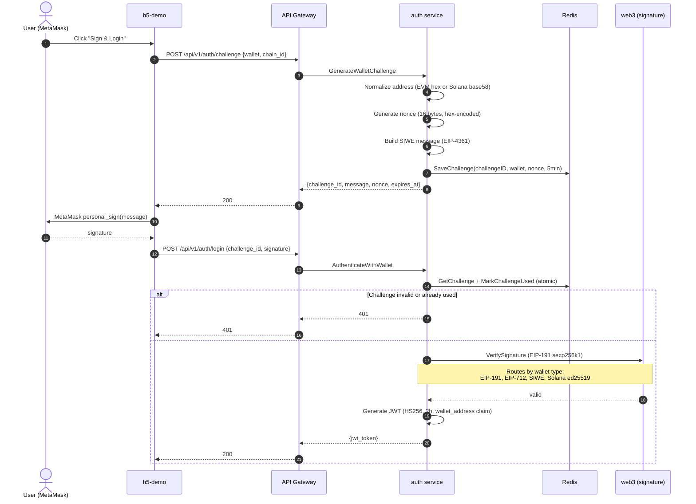
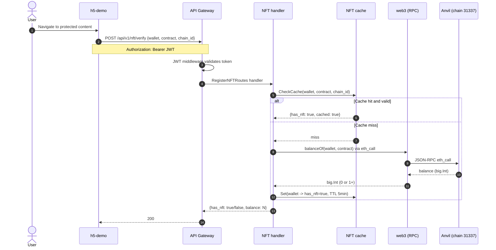
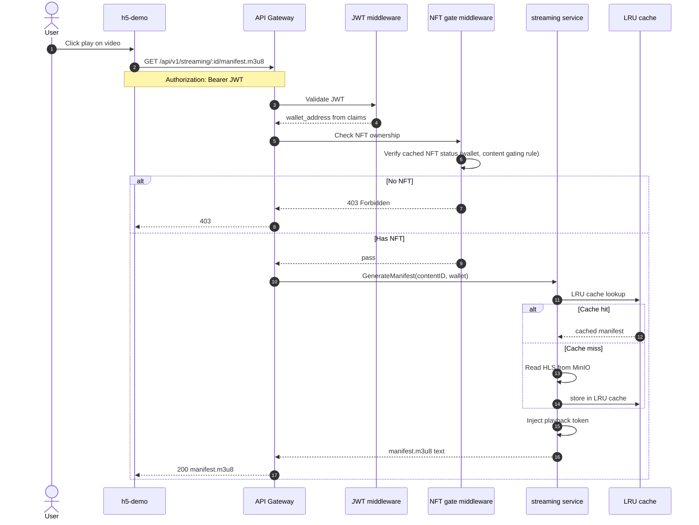
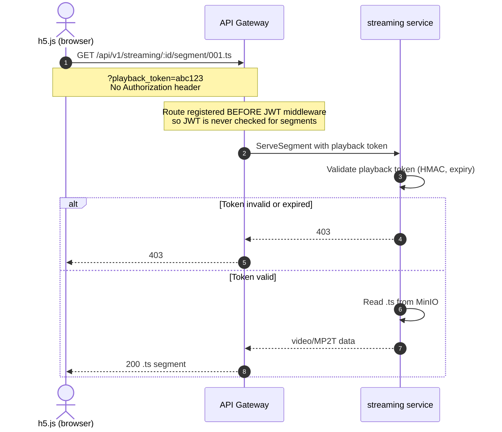

# Data Flow

> **Date**: 2026-06-05
> **Source**: Code analysis of `pkg/gateway/`, `pkg/middleware/`, `pkg/service/`, `pkg/web3/`, `pkg/storage/`
> **Status**: Single source of truth for request and media pipelines
> **Last verified against**: `master` branch (commit `96beacf`)

This document describes the 4 core data flows and the media pipeline. For protocol details, see [communication.md](communication.md). For service internals, see [microservices.md](microservices.md). Master context: [ARCHITECTURE.md](../ARCHITECTURE.md#5-core-data-flow-auth--nft--streaming).

---

## 1. Wallet Sign-In (Challenge -> Sign -> Verify -> JWT)

Entry: `pkg/gateway/auth_handlers.go:19-43`. Core logic: `pkg/service/auth_wallet.go`.



The challenge message follows EIP-4361 (Sign-In with Ethereum) by default, with fallback to plain EIP-191 and EIP-712 typed data. Solana wallets use ed25519 off-chain message verification. Replay protection is atomic via Redis `SETNX` or in-memory `sync.Map.LoadOrStore`.

---

## 2. NFT Ownership Verification

Entry: `pkg/gateway/nft_handlers.go:22-162`. Cache: in-memory LRU + optional Redis backend.



The NFT gate middleware (`pkg/middleware/nft_gate.go`) reuses the same cache. This means POST /api/v1/nft/verify and the streaming gate both check the same key with the same TTL -- preventing TOCTOU race conditions.

---

## 3. HLS Manifest Delivery (Gated)

Entry: `pkg/gateway/streaming_handlers.go`. Middleware: `pkg/middleware/nft_gate.go`. Route: `pkg/gateway/routes.go`.



The manifest contains segment URLs with short-lived playback tokens. The token replaces JWT for segment requests.

---

## 4. HLS Segment Delivery (Playback Token, No JWT)

Entry: `pkg/gateway/routes.go:52` -- the segment route is registered **before** JWT middleware. This is intentional.



This design enables CDN-friendly segment delivery. The playback token is a short-lived HMAC-signed string that the streaming service validates independently of the auth service.

---

## 5. Media Pipeline: Upload to Playback

The full pipeline from creator upload to viewer playback, as an ASCII diagram (Mermaid sequence is too complex for this branching flow):

```
Creator                     API Gateway                  Storage               Worker                Viewer
   |                            |                          |                      |                     |
   | POST /api/v1/upload/init   |                          |                      |                     |
   |--------------------------->|                          |                      |                     |
   | {filename, size, type}     |                          |                      |                     |
   |<-- {upload_id, chunk_size}-|                          |                      |                     |
   |                            |                          |                      |                     |
   | POST /api/v1/upload/chunk  |                          |                      |                     |
   | (binary, chunk_index, id)  |                          |                      |                     |
   |--------------------------->|-- PUT chunk ----------->| MinIO (tmp)           |                     |
   |<-- 200 --------------------|<-------------------------|                      |                     |
   | (repeat for all chunks)    |                          |                      |                     |
   |                            |                          |                      |                     |
   | POST /upload/:id/complete  |                          |                      |                     |
   |--------------------------->|-- Merge chunks -------->| MinIO (input bucket)  |                     |
   |                            |-- Enqueue transcode --->| NATS JetStream        |                     |
   |<-- {content_id} -----------|                          |                      |                     |
   |                            |                          |                      |                     |
   |                            |                          |  PullSubscribe       |                     |
   |                            |                          |--------------------->| transcoder worker   |
   |                            |                          |                      | FFmpeg: input.mp4   |
   |                            |                          |                      |  -> 240p/480p/720p  |
   |                            |                          |                      |  -> 1080p .ts files |
   |                            |                          |                      |  -> .m3u8 manifest  |
   |                            |                          |-- PUT HLS output --->| MinIO (streamgate)  |
   |                            |                          |<--- ack (progress) ---|                     |
   |                            |                          |                      |                     |
   |                            |                          |                      |                     |
   | Viewer loads player page   |                          |                      |                     |
   | hls.js initializes         |                          |                      |                     |
   | GET /streaming/:id/manifest|                          |                      |                     |
   |--------------------------->|-- Read manifest ------->| MinIO (streamgate)    |                     |
   |<-- manifest.m3u8 ----------|<-------------------------|                      |                     |
   | GET /streaming/:id/seg/1.ts|                          |                      |                     |
   |--------------------------->|-- Read segment -------->| MinIO (streamgate)    |                     |
   |<-- video/MP2T -------------|<-------------------------|                      |                     |
   |                            |                          |                      |                     |
   | (repeat for all segments)  |                          |                      |                     |
```

### Key characteristics

- **Upload**: chunked resumable upload with magic byte detection (`pkg/gateway/upload_handlers.go`, 848 lines)
- **Transcoding queue**: NATS JetStream with `TRANSCODING` stream and `transcoding-worker` consumer (`pkg/storage/nats_queue.go`)
- **FFmpeg profiles**: 240p, 480p, 720p (default), 1080p -- configurable per content
- **Progress**: status events at 0-100% per profile, polled by h5-demo every 2s
- **Cache invalidation**: post-transcode hook in `pkg/gateway/gateway.go:78-85` invalidates streaming LRU cache

---

## Cross-References

- Master architecture: [ARCHITECTURE.md](../ARCHITECTURE.md#5-core-data-flow-auth--nft--streaming)
- Communication: [communication.md](communication.md)
- Microservices: [microservices.md](microservices.md)
- Auth handler: `pkg/gateway/auth_handlers.go`
- NFT handler: `pkg/gateway/nft_handlers.go`
- Streaming handler: `pkg/gateway/streaming_handlers.go`
- NFT gate middleware: `pkg/middleware/nft_gate.go`
- Route registration: `pkg/gateway/routes.go`
- NATS queue: `pkg/storage/nats_queue.go`
