# Microkernel + Plugin Architecture

> **Date**: 2026-06-05
> **Source**: Code analysis of `pkg/core/` and `pkg/plugins/`
> **Status**: Single source of truth for plugin system design
> **Last verified against**: `master` branch (commit `96beacf`)

This document is a deep-dive into the microkernel and plugin system. It supplements the master architecture doc ([ARCHITECTURE.md](../ARCHITECTURE.md)) which provides the system-wide view. See also [microservices.md](microservices.md) for how plugins map to binaries.

---

## 1. The Plugin Interface

Every plugin implements this interface at `pkg/core/microkernel.go:63-75`:

```go
type Plugin interface {
    Name() string
    Version() string
    Init(ctx context.Context, kernel *Microkernel) error
    Start(ctx context.Context) error
    Stop(ctx context.Context) error
    Health(ctx context.Context) error
    DependsOn() []string
}
```

`DependsOn()` is the key innovation. It returns plugin names that must be initialized and started first. The kernel uses this to compute a topological ordering. Returning `nil` or an empty slice means no dependencies.

---

## 2. Plugin Lifecycle

```mermaid
flowchart TB
    subgraph START["kernel.Start(ctx)"]
        S1[topoSort plugins by DependsOn]
        S2[For each plugin in order: Init]
        S3[For each plugin in order: Start]
        S4[Register with Consul<br/>microservice mode only]
        S1 --> S2 --> S3 --> S4
    end

    subgraph SHUTDOWN["kernel.Shutdown(ctx)"]
        D1[Reverse-order: plugin.Stop]
        D2[Deregister Consul]
        D3[Close clientPool gRPC pool]
        D4[Close eventBus]
        D1 --> D2 --> D3 --> D4
    end

    MAIN[main()] -->|NewMicrokernel| CREATE
    subgraph CREATE["kernel.New()"]
        C1[Select event bus<br/>MemoryEventBus or NATS]
        C2[Create Consul registry<br/>microservice mode only]
        C3[Create gRPC client pool<br/>microservice mode only]
    end

    REGISTER[kernel.RegisterPlugin p] --> START
    LOAD[kernel.LoadRegisteredPlugins<br/>iterates init() factory map] -->|calls RegisterPlugin for each| REGISTER
    START -->|SIGINT/SIGTERM| DRAIN
    subgraph DRAIN["Drain state"]
        DR1[SetDraining: atomic.Bool = true]
        DR2[DrainMiddleware returns 503 to new requests]
        DR3[Wait 30s or second signal]
    end
    DRAIN --> SHUTDOWN
```

The exact lifecycle execution path is in `pkg/core/microkernel.go:211-341` (Start) and `pkg/core/microkernel.go:344-404` (Shutdown).

**Key behavior in monolith mode**: During Start, only the `api-gateway` plugin actually starts an HTTP server. The other 8 plugins skip HTTP start to avoid port conflicts (`pkg/core/generic_plugin.go:91-101`). Routes from all 8 service areas are served by the api-gateway's Gin router.

### Topological sort (Kahn's algorithm)

`pkg/core/microkernel.go:19-60` implements standard Kahn's algorithm:

```go
func topoSort(plugins map[string]Plugin, deps map[string][]string) ([]string, error)
```

It builds an adjacency list of dependents (dep -> depends-on-me), counts in-degrees, and peels off zero-in-degree nodes iteratively. Returns error on circular dependency. The result is used for both Init and Start ordering; Stop uses the reverse.

---

## 3. Three Plugin Implementation Styles

The codebase has 3 distinct styles plus a hybrid, documented here because the inconsistency is intentional (each choice has a reason):

```mermaid
flowchart TB
    subgraph STYLE1["Style 1: GenericPlugin (18 lines)"]
        A1["pkg/plugins/auth/plugin.go"]
        A2[NewAuthPlugin returns<br/>core.NewGenericPlugin]
        A3[Pure delegation to<br/>NewAuthServer]
        A1 --> A2 --> A3
    end

    subgraph STYLE2["Style 2: Manual full Plugin (98 lines)"]
        B1["pkg/plugins/cache/plugin.go<br/>pkg/plugins/metadata/plugin.go<br/>pkg/plugins/monitor/plugin.go<br/>pkg/plugins/transcoder/plugin.go<br/>pkg/plugins/upload/plugin.go<br/>pkg/plugins/worker/plugin.go"]
        B2[struct implements Plugin<br/>interface directly]
        B3[All 7 methods: Name, Version,<br/>Init, Start, Stop, Health, DependsOn]
        B1 --> B2 --> B3
    end

    subgraph STYLE3["Style 3: Custom + Deps (103 lines)"]
        C1["pkg/plugins/streaming/plugin.go"]
        C2[Same as Style 2 but<br/>DependsOn returns api-gateway<br/>in monolith mode]
        C3[Conditional dependency:<br/>nil in microservice mode<br/>api-gateway in monolith]
        C1 --> C2 --> C3
    end

    subgraph STYLE4["Style 4: Full custom (233 lines)"]
        D1["pkg/plugins/api/gateway.go<br/>named gateway.go NOT plugin.go"]
        D2[Bypasses GenericPlugin<br/>entirely]
        D3[Custom Init: wires HTTP + gRPC<br/>Custom Start: dual servers<br/>Custom Stop: graceful shutdown]
        D1 --> D2 --> D3
    end
```



| Style | Plugins | Lines | Why |
|-------|---------|-------|-----|
| GenericPlugin | auth | 18 | Stateless, single server, no custom wiring |
| Manual full | cache, metadata, monitor, transcoder, upload, worker | 98 | Need to hold server reference, has own routes |
| Custom + Deps | streaming | 103 | Needs `DependsOn(["api-gateway"])` in monolith mode |
| Full custom | api (gateway.go) | 233 | Dual HTTP+gRPC, unique startup sequence |

The 6 manual plugins have nearly identical code. This is a known area for consolidation.

---

## 4. Plugin Factory Registry

`pkg/core/registry.go:12-68` implements a global registry pattern:

```go
type PluginFactory func(cfg *config.Config, logger *zap.Logger) Plugin

var pluginFactories = make(map[string]PluginFactory)
```

Registration is done via `init()` functions in each plugin package:

- `pkg/plugins/auth/plugin.go:10-12`: `init() { core.RegisterPluginFactory("auth", NewAuthPlugin) }`
- Same pattern for all 9 plugin packages

**In monolith mode**, `cmd/monolith/streamgate/main.go` imports all 9 packages with blank identifiers:

```go
import (
    _ "github.com/rtcdance/streamgate/pkg/plugins/api"
    _ "github.com/rtcdance/streamgate/pkg/plugins/auth"
    // ... all 9
)
```

Go's runtime calls each `init()`, populating the global factory map. Then `kernel.LoadRegisteredPlugins()` at `pkg/core/registry.go:52-68` iterates the map and calls `kernel.RegisterPlugin()` for each.

**In microservice mode**, no blank imports are used. Each binary creates exactly one plugin directly.

---

## 5. Event Bus: Memory vs NATS

`pkg/core/event/event.go` defines:

- `Event` struct (Type, Source, Timestamp, Data) -- line 12-17
- `EventBus` interface (Publish, Subscribe, Unsubscribe, Close) -- line 38-43
- 14 event type constants -- lines 19-34

**MemoryEventBus** (`pkg/core/event/event.go:55-201`): In-process publish/subscribe with a concurrency semaphore (default 64). Used in monolith mode. Events never leave the process.

**NATS JetStream**: In microservice mode, the event bus connects to NATS (`pkg/storage/nats_queue.go`). Cross-process events enable service-to-service async communication.

Selection happens in `NewMicrokernel()` at `pkg/core/microkernel.go:93-153`:

- `cfg.Mode == "monolith"` -> `event.NewMemoryEventBus()`
- `cfg.Mode == "microservice"` -> NATS-based event bus

---

## 6. Drain State and Graceful Shutdown

`pkg/core/graceful.go:17-94` implements a drain pattern:

1. `drainState` is a package-level `atomic.Bool` -- line 17
2. `SetDraining()` flips it to true -- line 28-31
3. `DrainMiddleware()` returns a Gin middleware that responds 503 when draining -- lines 33-47
4. `GracefulShutdown()` blocks on signal, drains with timeout (default 30s), second signal forces exit -- lines 56-94

This is wired into the kernel's `Shutdown()` method. The drain is set BEFORE shutdown begins, so in-flight requests complete but new requests get 503.

---

## 7. RunMicroservice: Unused Helper

`pkg/core/microservice.go:19-73` contains a `RunMicroservice(name string, newPlugin func(cfg, logger) Plugin)` helper that would reduce each microservice's `main.go` from 76 lines to ~5 lines. It handles:

- Logger creation
- Config loading and validation
- Kernel creation and plugin registration
- Signal-based graceful shutdown

**No binary calls it.** All 9 microservices write the boilerplate manually. This is tracked as tech debt in the master architecture doc (Section 11, item 1).

---

## 8. Known Tech Debt

1. **6 nearly identical manual plugins** -- cache, metadata, monitor, transcoder, upload, worker all copy the same 98-line pattern. Could be collapsed via `GenericPlugin`.
2. **`RunMicroservice()` is dead code** -- `pkg/core/microservice.go` exists, works, but is not imported or called.
3. **Plugin file naming** -- `pkg/plugins/api/gateway.go` is named differently from `pkg/plugins/*/plugin.go`.
4. **Streaming `DependsOn` is mode-aware** -- returns `["api-gateway"]` in monolith but `nil` in microservice mode. This is a design smell; dependencies should not change based on deployment mode.

---

## Cross-References

- Master architecture: [ARCHITECTURE.md](../ARCHITECTURE.md#4-microkernel--plugin-architecture-c4-level-2)
- Microservice mapping: [microservices.md](microservices.md)
- Event bus implementation: `pkg/core/event/event.go`
- GenericPlugin source: `pkg/core/generic_plugin.go`
- Registry source: `pkg/core/registry.go`
- Graceful shutdown: `pkg/core/graceful.go`
