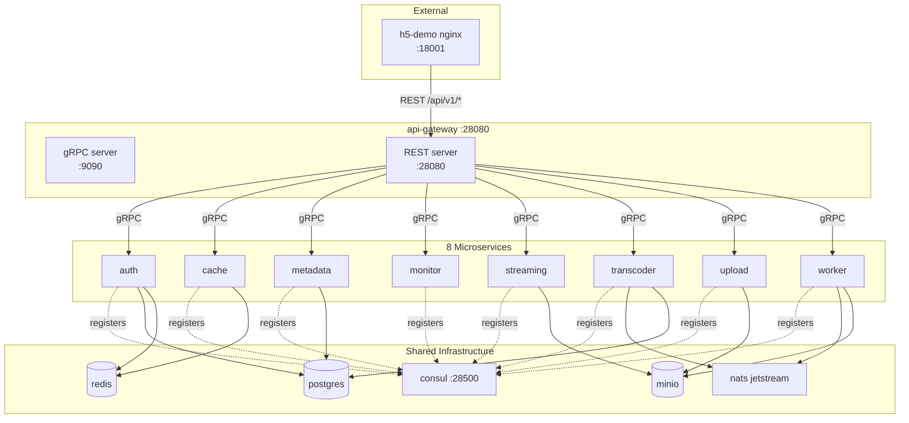
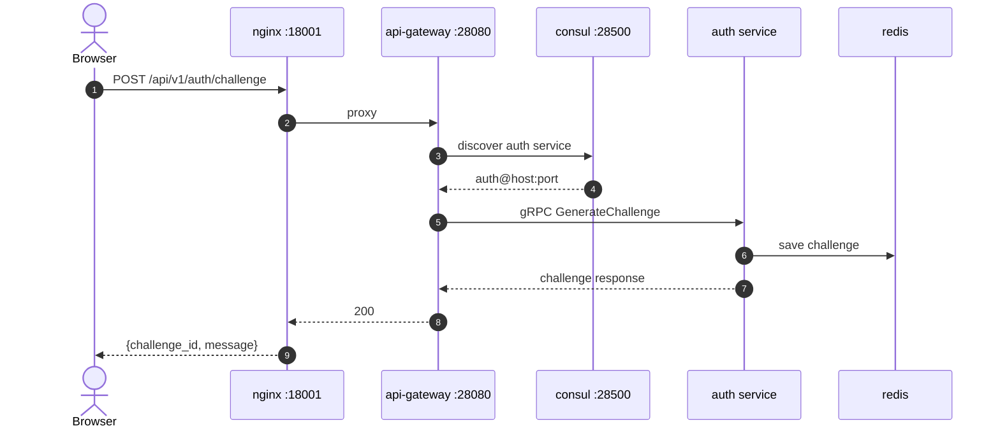

# Microservices

> **Date**: 2026-06-05
> **Source**: Code analysis of `cmd/microservices/` and `pkg/plugins/`
> **Status**: Single source of truth for microservice architecture
> **Last verified against**: `master` branch (commit `96beacf`)

This document describes the 9 microservices, their responsibilities, how they communicate, and why the api-gateway is unique. It supplements [ARCHITECTURE.md](../ARCHITECTURE.md) (dual deployment, C4 diagrams) and [microkernel.md](microkernel.md) (plugin system internals).

---

## 1. Plugin-to-Microservice Mapping

Each microservice corresponds to a plugin package and a main.go in `cmd/microservices/`:

| Factory name | Plugin package | Microservice binary | Lines | Uses kernel? | Port source |
|---|---|---|---|---|---|
| `api-gateway` | `pkg/plugins/api/gateway.go` | `cmd/microservices/api-gateway/main.go` | 118 | **NO** -- direct wiring | HTTP from config, gRPC 9090 |
| `auth` | `pkg/plugins/auth/plugin.go` | `cmd/microservices/auth/main.go` | 89 | Yes, manual | Config |
| `cache` | `pkg/plugins/cache/plugin.go` | `cmd/microservices/cache/main.go` | 89 | Yes, manual | Config |
| `metadata` | `pkg/plugins/metadata/plugin.go` | `cmd/microservices/metadata/main.go` | 89 | Yes, manual | Config |
| `monitor` | `pkg/plugins/monitor/plugin.go` | `cmd/microservices/monitor/main.go` | 89 | Yes, manual | Config |
| `streaming` | `pkg/plugins/streaming/plugin.go` | `cmd/microservices/streaming/main.go` | 89 | Yes, manual | Config |
| `transcoder` | `pkg/plugins/transcoder/plugin.go` | `cmd/microservices/transcoder/main.go` | 89 | Yes, manual | Config |
| `upload` | `pkg/plugins/upload/plugin.go` | `cmd/microservices/upload/main.go` | 89 | Yes, manual | Config |
| `worker` | `pkg/plugins/worker/plugin.go` | `cmd/microservices/worker/main.go` | 89 | Yes, manual | Config |

---

## 2. Why api-gateway is Unique

The api-gateway is the only microservice that **does not use the microkernel**. Its `main.go` directly calls:

```go
router, resources, err := gateway.SetupRouter(cfg, log)
// ...
grpcServer := gateway.SetupGRPCServer(cfg, log)
```

See `pkg/plugins/api/gateway.go` (233 lines, named `gateway.go` not `plugin.go`). It bypasses plugin registration entirely because:

1. The gateway owns all 48 REST handler files -- it needs direct access to `gateway.SetupRouter()`
2. It runs dual HTTP + gRPC servers, which the microkernel doesn't natively support
3. It doesn't register with Consul (it IS the gateway; other services register with it)
4. No factory indirection is needed -- there is only one gateway per deployment

The other 8 services use a standard pattern: create kernel, register one plugin, start, wait.

---

## 3. Why the Other 8 Use 89-Line Boilerplate

Every non-gateway `main.go` follows this pattern:

```go
func main() {
    log := logger.NewDevelopmentLogger("streamgate-<name>")
    defer log.Sync()

    cfg, err := config.LoadConfig()
    // ... error handling ...

    cfg.Mode = "microservice"
    cfg.ServiceName = "<name>"
    cfg.ValidateProduction(log)

    kernel, err := core.NewMicrokernel(cfg, log)
    // ... error handling ...

    kernel.RegisterPlugin(<name>plugin.New<Name>Plugin(cfg, log))

    ctx, cancel := context.WithCancel(context.Background())
    defer cancel()
    kernel.Start(ctx)

    // signal wait ...
    kernel.Shutdown(shutdownCtx)
}
```

This is 76 lines of boilerplate per binary, 608 lines total across 8 services. The helper `core.RunMicroservice()` (`pkg/core/microservice.go:19-73`) would reduce each to ~5 lines, but no binary calls it.

---

## 4. Per-Service Responsibilities

### auth
Wallet sign-in service. Generates EIP-4361 SIWE challenges, verifies EIP-191/712 signatures, issues JWTs (HS256, 2h), and manages challenge replay protection. Entry: `pkg/service/auth_wallet.go`.

### cache
Dedicated cache service. Provides distributed caching for NFT ownership results, manifest data, and other frequently accessed state. Backed by Redis.

### metadata
Content metadata CRUD. Manages video titles, descriptions, tags, categories, and gating rules. Backed by PostgreSQL.

### monitor
Operational monitoring service. Exposes `/health`, `/ready`, `/metrics`, and `/health/live` endpoints for Kubernetes probes and Prometheus scraping.

### streaming
HLS manifest generation and segment delivery. Generates `.m3u8` playlists, serves `.ts` segments with playback token validation. Uses LRU cache for manifest responses. Entry: `pkg/service/streamingsvc/`.

### transcoder
FFmpeg transcoding orchestration. Submits jobs to the NATS transcoding queue, monitors progress, updates task status. Supports 4 profiles: 240p, 480p, 720p (default), 1080p. Entry: `pkg/service/transcoding/`.

### upload
Chunked resumable video upload. Handles single-file and multi-part uploads with magic byte detection, integrity checks, and MinIO storage. Entry: `pkg/gateway/upload_handlers.go` (848 lines).

### worker
Background task worker. Pulls transcoding jobs from the NATS JetStream queue (`TRANSCODING` stream, `transcoding-worker` consumer), executes FFmpeg, reports progress via status events. Entry: `pkg/storage/nats_queue.go`.

---

## 5. Service Communication



### Communication protocols

- **gRPC** -- api-gateway to other 8 microservices. Service discovery via Consul. `pkg/gateway/grpc_server.go` (1246 lines) defines interceptors, TLS, health protocol, and reflection.
- **HTTP** -- h5-demo nginx to api-gateway. REST over Gin. Only the api-gateway and monolith expose HTTP.
- **NATS JetStream** -- Async event bus and task queue. Used for transcoding job submission (`TRANSCODING` stream), progress events, and cross-service events.
- **Consul** -- Service registration and health checking. Only active in microservice mode. Each of the 8 services registers on startup and deregisters on shutdown.

---

## 6. Request Flow: End-to-End



In monolith mode, steps through consul are skipped. The api-gateway plugin calls service functions directly in-process.

---

## 7. Known Issues

1. **8 microservice binaries untested in CI** -- the `cmd/microservices/{auth,...,worker}/main.go` files compile but individual HTTP endpoints have limited end-to-end test coverage.
2. **`RunMicroservice()` unused** -- see [microkernel.md](microkernel.md#7-runmicroservice-unused-helper).
3. **Transcoder shutdown** -- `cmd/microservices/transcoder/main.go` uses a 60s shutdown timeout (vs 30s for others) to let in-flight FFmpeg jobs finish. The other 7 use 30s.
4. **8 services depend on consul only** -- they don't depend on postgres/redis/minio/nats being healthy at startup. Healthy dependencies are checked at request time.

---

## Cross-References

- Master architecture: [ARCHITECTURE.md](../ARCHITECTURE.md#3-dual-deployment-mode-same-code-different-topology)
- Plugin system: [microkernel.md](microkernel.md)
- Communication protocols: [communication.md](communication.md)
- Data flows: [data-flow.md](data-flow.md)
- gRPC server: `pkg/gateway/grpc_server.go`
- Full-chain compose: `docker-compose.fullchain.yml`
