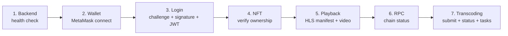

# StreamGate h5-demo Operational Console

> **Updated 2026-06-05** to reflect dual-mode fullchain architecture. Previous version (2025-01-28) described an aspirational `pkg/dashboard` package that does not exist.
>
> Status: Operational Console Guide
> Cross-reference: [h5-demo/README.md](../../h5-demo/README.md), [DEPLOY.md](../../DEPLOY.md), [architecture/data-flow.md](../architecture/data-flow.md)

---

## What the dashboard actually is

The StreamGate "dashboard" is the **h5-demo** directory (`h5-demo/`, ~6000 lines of HTML + JavaScript). It is a single-page application (SPA) acceptance console, not a metrics dashboard. It validates the complete end-to-end path:

- Wallet challenge login
- NFT verification
- Protected HLS playback
- RPC failover visibility
- Transcoding submit / status / tasks / profiles

There is no `pkg/dashboard` Go package. The January 2025 dashboard guide described code (`RecordMetric`, `GetMetrics`, `GetAlerts`) that was never implemented. The operational console is entirely client-side, served by nginx.

---

## 7-step flow



Each step must pass before the next is enabled. The right-side checklist and the top summary bar update as each step completes. See [h5-demo/README.md](../../h5-demo/README.md#recommended-acceptance-flow) for detailed per-step instructions.

---

## Architecture

The h5-demo SPA is served by nginx (`deploy/nginx/default.conf`) in a dual-port configuration.

| Port | nginx server | Proxied upstream | Header |
|------|-------------|-------------------|--------|
| `:18000` | `listen 8080` (mapped) | `host.docker.internal:18080` (monolith) | `X-Proxy-Mode: monolith` |
| `:18001` | `listen 8081` (mapped) | `host.docker.internal:28080` (microservices) | `X-Proxy-Mode: microservices` |

The h5-demo JavaScript auto-detects the proxy mode by inspecting the `X-Proxy-Mode` response header or by the URL port. The same `deploy/nginx/default.conf` file serves both ports from the same document root.

```
Browser on :18000       nginx (port 8080/8081)        Backend
     │                        │                          │
     │ GET /demo/index.html   │                          │
     │───────────────────────>│                          │
     │<── index.html ─────────│                          │
     │                        │                          │
     │ POST /api/v1/auth/...  │                          │
     │───────────────────────>│ proxy to :18080/:28080   │
     │                        │─────────────────────────>│
     │<── response ───────────│<─────────────────────────│
```

Key behavior of the nginx proxy (`deploy/nginx/default.conf`):

- `/health` and `/metrics` are proxied to the backend on both ports
- `/api/` is proxied with header forwarding (`Host`, `X-Real-IP`, `Origin`)
- `client_max_body_size 500M` allows large uploads
- CSP headers are set for security (no inline scripts in strict mode)
- The `X-Proxy-Mode` header tells the JS which backend mode is active

---

## Page structure

| File | Purpose |
|------|---------|
| `h5-demo/index.html` (577 lines) | Main SPA with 7-step acceptance flow |
| `h5-demo/flow.html` (433 lines) | Simplified user flow: upload then watch |
| `h5-demo/flow-v2.html` | ChainPulse dark theme variant |
| `h5-demo/debug.html` | Debug information panel |
| `h5-demo/trace.html` | Request trace viewer |
| `h5-demo/playground.html` | API playground for experimenting |

JavaScript modules in `h5-demo/js/`:

| File | Purpose |
|------|---------|
| `js/api.js` | `APIService` class - REST client for all endpoints |
| `js/app.js` (1784 lines) | `StreamGateApp` - main application logic |
| `js/auth.js` | Auth helper functions |
| `js/wallet.js` | MetaMask wallet connection (ethers.js v5) |
| `js/player.js` | HLS.js player integration |

---

## Backend URL configuration

The SPA has a configurable backend URL in the top bar:

| Mode | Default URL | Change how |
|------|-------------|------------|
| Monolith | `http://localhost:18080` | Default on page load |
| Microservices | `http://localhost:28080` | Edit field, click "Save Backend URL" |

The JavaScript stores the URL in `localStorage` under the key `backend_url`. On page reload, it reads the saved value. The acceptance port auto-detection logic recognizes these ports:

```javascript
const ACCEPTANCE_BACKEND_PORTS = new Set(['18080', '18000', '18001', '19090', '28080', '29091']);
```

---

## JWT secret

The dev/acceptance JWT secret is **`fullchain-acceptance-secret-2026`**. It must match the backend environment variable `STREAMGATE_AUTH_JWT_SECRET`.

| Deployment | Env var source | Value |
|------------|---------------|-------|
| docker-compose.fullchain.yml | `STREAMGATE_AUTH_JWT_SECRET` | `fullchain-acceptance-secret-2026` |
| docker-compose.monolith.yml | same | `fullchain-acceptance-secret-2026` |

If the JWT secret in the backend does not match what the h5-demo expects, JWT verification will fail silently (401 on protected endpoints). Align the secret before deploying.

---

## Acceptance testing

Two scripts provide repeatable acceptance testing without the browser UI:

### `./scripts/verify-deploy.sh`

8 automated checks against the current stack:

1. Docker daemon running
2. Container health (all `sg-fc-*` containers running)
3. Backend `/health` endpoint
4. Backend `/api/v1/health` endpoint
5. `/metrics` endpoint reachable
6. h5-demo nginx responding on `:18000` or `:18001`
7. Anvil RPC responding
8. Auth challenge endpoint returns 200

### `./scripts/fullchain-acceptance.sh`

11 API-level checks against a specific backend port:

1. PostgreSQL reachable
2. Redis reachable
3. MinIO reachable
4. NATS reachable
5. Anvil reachable
6. Backend health check
7. Auth challenge roundtrip
8. NFT verify roundtrip
9. Manifest auth check
10. Transcode submit/status/tasks/profiles
11. Prometheus `/metrics` endpoint

Usage:

```bash
./scripts/verify-deploy.sh
./scripts/fullchain-acceptance.sh 18080   # monolith
./scripts/fullchain-acceptance.sh 28080   # microservices
```

---

## Transcoding progress UI

The h5-demo transcoding section shows per-profile progress bars during active transcoding jobs:

| Profile | Resolution | Bitrate range |
|---------|-----------|---------------|
| 240p | 426x240 | 400-800 Kbps |
| 480p | 854x480 | 800-2000 Kbps |
| 720p (default) | 1280x720 | 2000-4000 Kbps |
| 1080p | 1920x1080 | 4000-8000 Kbps |

The UI polls `GET /api/v1/transcode/status/:id` every 2 seconds while a job is in progress. Each profile's progress (0-100%) is rendered as a separate progress bar. When all profiles reach 100%, the status changes to `completed`.

---

## NFT auto-mint

For the local Anvil testnet (chain ID 31337), the h5-demo includes a "Mint NFT" button that calls the public mint function on the DemoNFT contract (`0x5FbDB2315678afecb367f032d93F642f64180aa3`). This allows any connected wallet to obtain a demo NFT for testing.

| Configuration | Value |
|---------------|-------|
| NFT contract | `0x5FbDB2315678afecb367f032d93F642f64180aa3` |
| Public mint selector | `0x6a627842` |
| Chain ID | 31337 (Anvil local) |
| Anvil RPC | `http://localhost:18545` |
| Demo video ID | `demo` |

The auto-mint feature is available on steps 2-3. After minting, proceed to NFT verification (step 4) to confirm ownership.

---

## Known issues

1. **Admin mode detection by port number.** The JavaScript detects whether it is talking to monolith or microservices by checking the backend URL port. If custom port mappings are used, the detection logic in `h5-demo/js/api.js` may misidentify the backend mode.

2. **JWT secret must be aligned.** The `fullchain-acceptance-secret-2026` value is hardcoded in each docker-compose file. If changed in one place but not another, auth will fail silently. Always update all compose files and the h5-demo config together.

3. **h5-demo is not a production dashboard.** It does not provide persistent monitoring, alerting, or historical metrics. It is an acceptance tool for validating the E2E path.

4. **Cross-origin issues.** If the h5-demo is served from a different origin than the backend, browser CORS policies may block requests. The backend allows configurable CORS origins via `STREAMGATE_CORS_ORIGINS`. The `deploy/nginx/default.conf` forwards `Origin` headers to avoid this when served through nginx.

5. **MetaMask file:// access.** If opening `index.html` via `file://` protocol, MetaMask may not inject its provider. Serve the h5-demo through nginx or use a local static server.

---

## Cross-references

- [h5-demo/README.md](../../h5-demo/README.md) - Detailed acceptance checklist and test configuration
- [DEPLOY.md](../../DEPLOY.md) - Deployment instructions for all modes
- [architecture/data-flow.md](../architecture/data-flow.md) - Auth, NFT, streaming data flow
- [ARCHITECTURE.md](../ARCHITECTURE.md) - System architecture overview
- [docs/development/MONITORING_INFRASTRUCTURE.md](MONITORING_INFRASTRUCTURE.md) - Current observability state
