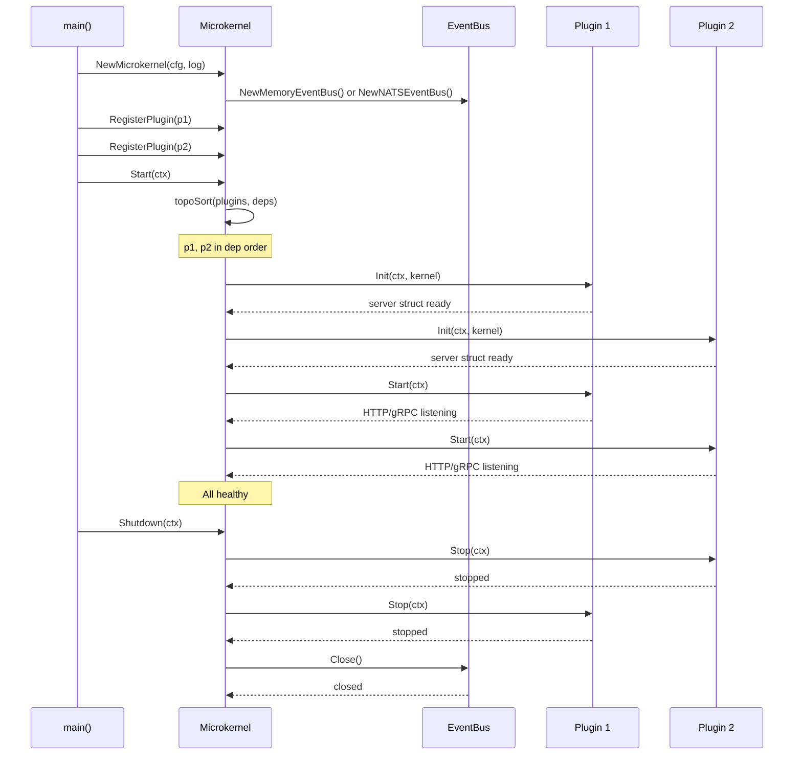
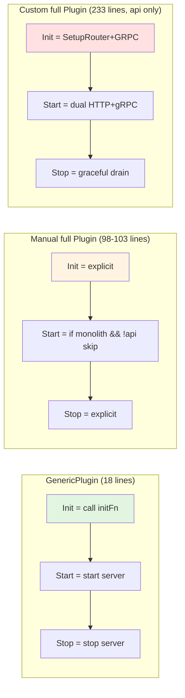
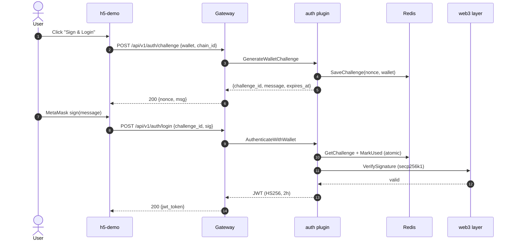

# StreamGate Architecture Deep Dive

> **Updated 2026-06-05** to reflect the dual-mode microkernel + plugin architecture. The previous version (2025-01-29) used pre-dual-mode terminology. This file preserves the deep-dive structure but updates content to match the current code.
>
> **Last verified against**: `master` branch (commit `96beacf`)
> **Cross-references**: [ARCHITECTURE.md](../ARCHITECTURE.md), [architecture/microkernel.md](../architecture/microkernel.md), [architecture/microservices.md](../architecture/microservices.md)

---

## What changed since the last version

The previous version of this file described:

- A simpler microkernel without `DependsOn()` or topological sort
- A "plugin" concept without the `GenericPlugin` boilerplate wrapper
- A single deployment mode (no monolith vs microservices distinction)
- A Prometheus + Grafana + Jaeger stack that has since been removed

This version reflects:

- **Plugin interface** with `DependsOn()` and Kahn's topological sort (`pkg/core/microkernel.go:19-60, 63-75`)
- **3 plugin implementation styles**: `GenericPlugin` (auth), Manual (7 others), Custom (api-gateway)
- **Dual deployment mode**: monolith (1 process) and microservices (9 binaries) sharing the same plugin code
- **Simplified observability**: `/metrics` endpoint exists but is not scraped; no Grafana, no Jaeger

---

## 1. Microkernel Architecture

### Core concept

The microkernel is a plugin host with the following responsibilities:

- **Plugin lifecycle**: register → topological sort by dependencies → Init in order → Start in order → Stop in reverse order
- **Event bus**: in-memory (monolith) or NATS JetStream (microservices)
- **Config**: Viper-based with hot reload via file watcher
- **Graceful shutdown**: drain state with 30s timeout, second signal forces exit

### Interface

```go
type Plugin interface {
    Name() string
    Version() string
    Init(ctx context.Context, kernel *Microkernel) error
    Start(ctx context.Context) error
    Stop(ctx context.Context) error
    Health() error
    DependsOn() []string
}
```

(`pkg/core/microkernel.go:63-75`)

### Topological sort

Plugins declare dependencies via `DependsOn()`. The kernel uses Kahn's algorithm to determine start order. Example:

```
metadata depends on: []
worker depends on: [transcoder]
streaming depends on: [api-gateway]  (only in monolith mode)
```

The dependency graph is acyclic. If a cycle is detected, `Start()` returns an error.

### Lifecycle sequence



---

## 2. Plugin System

### 3 implementation styles



**GenericPlugin** (`pkg/core/generic_plugin.go:19-33`) — used only by `auth`. The 18-line wrapper takes a `name`, `version`, `initFn func(kernel) server`, and the rest is boilerplate.

**Manual full Plugin** — used by `cache`, `metadata`, `monitor`, `transcoder`, `upload`, `worker` (98 lines each) and `streaming` (103 lines, adds `DependsOn` for monolith). These plugins need more control: some have dependencies, some skip HTTP in monolith mode, some have shutdown timeout overrides.

**Custom full Plugin** — used only by `api-gateway` (`pkg/plugins/api/gateway.go`, 233 lines). The gateway is special because it wires all 48 handler files, has dual HTTP+gRPC servers, and registers with Consul.

### Plugin to microservice mapping

| Plugin | Plugin file | Lines | Style | Microservice binary | Uses kernel? |
|--------|-------------|-------|-------|---------------------|--------------|
| api | `pkg/plugins/api/gateway.go` | 233 | Custom | `cmd/microservices/api-gateway` | **No** (bypasses) |
| auth | `pkg/plugins/auth/plugin.go` | 18 | GenericPlugin | `cmd/microservices/auth` | Yes |
| cache | `pkg/plugins/cache/plugin.go` | 98 | Manual | `cmd/microservices/cache` | Yes |
| metadata | `pkg/plugins/metadata/plugin.go` | 98 | Manual | `cmd/microservices/metadata` | Yes |
| monitor | `pkg/plugins/monitor/plugin.go` | 98 | Manual | `cmd/microservices/monitor` | Yes |
| streaming | `pkg/plugins/streaming/plugin.go` | 103 | Manual+Deps | `cmd/microservices/streaming` | Yes |
| transcoder | `pkg/plugins/transcoder/plugin.go` | 98 | Manual | `cmd/microservices/transcoder` | Yes |
| upload | `pkg/plugins/upload/plugin.go` | 98 | Manual | `cmd/microservices/upload` | Yes |
| worker | `pkg/plugins/worker/plugin.go` | 98 | Manual | `cmd/microservices/worker` | Yes |

### Why 3 styles?

- **GenericPlugin** is great for stateless services with no special init/start logic. The auth plugin is the only one simple enough.
- **Manual** is the right pattern when you need to conditionally skip HTTP (e.g., in monolith mode for non-gateway plugins) or when you have custom dependencies.
- **Custom** is for one-of-a-kind plugins. The api-gateway has so much custom logic (12-middleware stack, 11 route groups, gRPC interceptors, Consul registration) that it doesn't fit a template.

**Tech debt callout**: `pkg/core/microservice.go:19-73` has a `RunMicroservice(name, newPlugin)` helper that would reduce 8 of the 9 microservice main.go files to 5 lines each. **None of the binaries actually use it.**

---

## 3. Service Communication

### 3 protocols

| Protocol | Used in | When | Reference |
|----------|---------|------|-----------|
| **HTTP** (Gin) | External clients, h5-demo | Always | `pkg/gateway/gateway.go:124-154` |
| **gRPC** | Microservice-to-microservice | Microservices mode only | `pkg/gateway/grpc_server.go:1246 lines` |
| **Event bus** (Memory or NATS) | Cross-plugin notifications | Always (Memory in monolith, NATS in microservices) | `pkg/core/event/event.go` |

### 12-middleware HTTP stack

Registered in order in `pkg/gateway/gateway.go:124-154`:

1. Recovery (panic → 500)
2. Request ID (correlation)
3. Structured logger (zap)
4. CORS
5. Rate limit (global + per-IP)
6. Tracing (OpenTelemetry, but exporter removed)
7. Metrics (Prometheus text)
8. Drain state (return 503 when shutting down)
9. Auth (JWT skip paths: /health, /auth/challenge, /auth/login, /streaming/:id/segment/*)
10. NFT gate (only on protected routes)
11. Timeout
12. Real IP (for accurate rate limit)

Note: **segment routes are registered BEFORE JWT middleware** (`pkg/gateway/routes.go:52`). Segments use playback tokens, not JWTs, so JWT is bypassed for that path.

### Token propagation

| Token | Issuer | Lifetime | Used by |
|-------|--------|----------|---------|
| JWT (HS256) | auth plugin | 2h | All `/api/v1/*` except segment route |
| Playback token | streaming service | per-manifest | `/api/v1/streaming/:id/segment/:seg` |
| Challenge nonce | auth service | 5min | One-time wallet signature |

### Consul service discovery

Used **only in microservices mode**. Each of the 8 non-gateway services registers with Consul on startup; the api-gateway looks up service addresses via Consul. In monolith mode, Consul is not started and not used.

---

## 4. Data Flow

### Wallet sign-in (challenge → sign → JWT)



### NFT ownership verification (cache-first with TOCTOU prevention)

The NFT verify handler implements a cache-first pattern to prevent TOCTOU (Time-of-Check-Time-of-Use) race conditions:

1. Check cache (Redis or in-memory LRU) for `wallet → has_nft`
2. If cache hit: return cached value (no RPC call)
3. If cache miss: call `balanceOf(wallet, contract)` via web3 layer
4. Cache the result with 5-minute TTL
5. Return result

**TOCTOU prevention**: The cache key is the same for both verify calls and streaming gate calls, so a reorg or wallet change invalidates both within 5 minutes.

### HLS manifest + segment delivery

Manifest delivery requires JWT + NFT ownership. Segment delivery uses playback tokens only.

**Manifest flow**: Request → JWT middleware (auth) → NFT gate middleware (cache check) → streaming handler → MinIO GET → HLS manifest text

**Segment flow**: Request → (no JWT) → playback token validation → streaming handler → MinIO GET → .ts segment

The segment route is registered before the JWT middleware in `pkg/gateway/routes.go:52` to make this asymmetric auth possible.

---

## 5. Scalability Design

### Dual mode for different scales

| Scale | Mode | Why |
|-------|------|-----|
| < 100 RPS | Monolith (1 process) | Simpler, faster boot, lower memory |
| 100-1000 RPS | Microservices (9 binaries) | Independent scaling, fault isolation |
| > 1000 RPS | Microservices + HPA | Per-service horizontal scaling |

### Per-service resource limits (microservices)

| Service | CPU | Memory | Justification |
|---------|-----|--------|---------------|
| api-gateway | 1.0 | 512MB | High HTTP traffic |
| auth | 0.3 | 256MB | CPU-bound crypto |
| cache | 0.2 | 512MB | Memory-heavy (LRU) |
| metadata | 0.3 | 256MB | DB-bound |
| monitor | 0.2 | 256MB | Metrics aggregation |
| streaming | 0.5 | 512MB | I/O-bound (MinIO) |
| transcoder | 2.0 | 2GB | CPU-bound (FFmpeg) |
| upload | 0.5 | 512MB | I/O-bound (MinIO) |
| worker | 1.0 | 1GB | Job processing |

Total microservices: 6.0 CPU, 6GB RAM
Total monolith: 2.0 CPU, 2GB RAM

---

## 6. Reliability Patterns

### Circuit breaker (7 critical paths)

Wrapped in `pkg/core/circuitbreaker/`:

1. PostgreSQL queries
2. Redis operations
3. MinIO/S3 operations
4. NATS JetStream operations
5. RPC client (Ethereum)
6. RPC client (Solana)
7. Auth challenge store

Each circuit breaker has:
- Failure threshold: 5 consecutive failures → open
- Reset timeout: 30s → half-open
- Success threshold: 3 consecutive successes → closed

### Drain state

`pkg/core/graceful.go:17-94` implements drain state via `atomic.Bool`:

- `DrainMiddleware` returns 503 to new requests when draining
- `GracefulShutdown()` sets drain → waits 30s → calls `kernel.Shutdown()`
- Second SIGINT/SIGTERM forces immediate exit

### Replay protection (TOCTOU)

`MarkChallengeUsed()` is atomic:
- Redis: `SET key value NX EX 300` (atomic, 5min TTL)
- In-memory: `sync.Map` with `LoadOrStore` (atomic)
- Returns error if challenge was already used

### Chain reorg protection

`pkg/web3/reorg.go` subscribes to new block events and invalidates NFT cache entries on reorg. Cache TTL is also 5min to bound the damage of any race.

---

## 7. Performance Optimizations

### Built-in

- LRU cache for streaming manifests (avoids re-generating for popular content)
- Concurrent stream limiter (max streams per content)
- Connection pooling for PostgreSQL, Redis, MinIO
- In-memory challenge store fallback when Redis is down
- Circuit breaker prevents cascade failures

### Recommended for high scale (not built-in)

- CDN in front of HLS segments (CloudFront, Cloudflare)
- Read replicas for PostgreSQL
- Redis cluster for cache sharding
- NATS clustering for event bus HA

---

## See also

- [ARCHITECTURE.md](../ARCHITECTURE.md) — system overview
- [architecture/microkernel.md](../architecture/microkernel.md) — plugin system deep-dive
- [architecture/microservices.md](../architecture/microservices.md) — 9 services deep-dive
- [architecture/data-flow.md](../architecture/data-flow.md) — auth, NFT, streaming, transcoding flows
- [architecture/communication.md](../architecture/communication.md) — HTTP, gRPC, event bus
