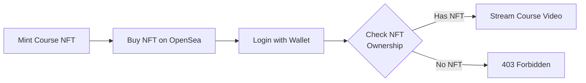
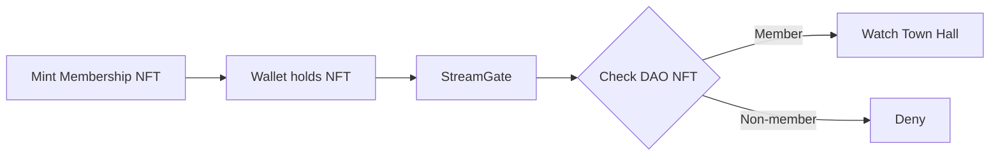
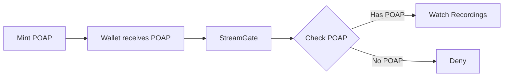

# StreamGate Use Cases

## 1. NFT-Gated Online Courses

**Scenario:** A creator sells access to video courses by minting a course-specific NFT.
Students who hold the NFT can stream the course content; those who don't cannot.

**Why StreamGate:**
- No password sharing — access follows the NFT, not a login credential
- No manual enrollment — buying the NFT = automatic access
- Secondary market works — reselling the NFT transfers access

**Who this is for:** Online educators, course platforms, cohort-based courses

---

## 2. DAO Member-Exclusive Content

**Scenario:** A DAO holds weekly video town halls and strategy updates.
Only wallets holding the DAO's membership NFT can watch.

**Why StreamGate:**
- Dynamic membership — new members get access instantly when they acquire the NFT
- No admin overhead — no need to manually add/remove users from an access list
- Transparent — which NFTs grant access is on-chain and auditable

**Who this is for:** DAOs, token-gated communities, member-only media

---

## 3. Event Recording Access via POAP/Event NFT

**Scenario:** A conference mints a POAP (Proof of Attendance Protocol) NFT for attendees.
Attendees use the same wallet to watch recorded sessions post-event.

**Why StreamGate:**
- Time-limited access — POAPs can expire, automatically revoking access
- Transferable tickets — POAP in wallet = access, without login/password
- Gated archival — recordings remain accessible only to attendees

**Who this is for:** Conference organizers, event platforms, music festivals